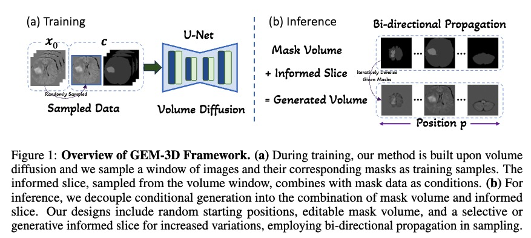

# Generative Enhancement for 3D Medical Images

This is the official code for https://arxiv.org/abs/2403.12852.



## Installation

Clone this repository and install packages:
```
git clone https://github.com/HKU-MedAI/GEM-3D.git
conda env create --file environment.yml
conda activate gem
```

## Preparation

1. The preprocessed datasets can be found [here](https://connecthkuhk-my.sharepoint.com/:u:/g/personal/ltzhu99_connect_hku_hk/ES0_s1XN3_BDhQn6W3cPvPgB-LnX9SJqUcBQ3dA8g-jqZA?e=3qiz5v). (For BraTS, we use the version from [Medical Segmentation Decathlon](http://medicaldecathlon.com/#tasks) and only use the FLAIR modality. For abdomen dataset, we crop the outlier regions where contain too many empty slices. Note that we need the gt segmentation for benchmark, and we mannually split the training splits. The datasets are preprocessed with [nnUNet](https://github.com/MIC-DKFZ/nnUNet).)

2. Download [KL-f8 AE](https://ommer-lab.com/files/latent-diffusion/kl-f8.zip) from [LDM](https://github.com/CompVis/latent-diffusion).


3. You can download our pretrained models [here](https://connecthkuhk-my.sharepoint.com/:u:/g/personal/ltzhu99_connect_hku_hk/EdGegBBAYVZMnhLhAvs46OUBRDPVmYBI6IqX20K3OWGTQA?e=McrYWl).

## Training
```
# stage 1, 150k iters
CUDA_VISIBLE_DEVICES=0,1,2,3,4,5,6,7 python main.py --base configs/latent-diffusion/brain_stage1.yaml -t --gpus 0,1,2,3,4,5,6,7,

# Edit the path-to-stage1-ckpt keyword in the stage 2 yaml
vi configs/latent-diffusion/brain_stage2.yaml

# stage 2, 50k iters
CUDA_VISIBLE_DEVICES=0,1,2,3,4,5,6,7 python main.py --base configs/latent-diffusion/brain_stage2.yaml -t --gpus 0,1,2,3,4,5,6,7,
```
```
# baseline (a modified version of Make-A-Volume[MICCAI 2023]): use the yaml with 'base' and train the models in two stages, the same as the commands above
```
```
# position conditioned slice generation model (one-stage), 150k iters
CUDA_VISIBLE_DEVICES=0,1,2,3,4,5,6,7 python main.py --base configs/latent-diffusion/brain_slice.yaml -t --gpus 0,1,2,3,4,5,6,7,
```
Note that the training costs more than 30G for each card, requiring GPUs like V100 and A100. 

And the training can also be conducted with fewer cards.

## Inference

Prepare the models in the directory `infer_model/`.
```
# postfix:
# {ic,icma,ig,igma} correspond to the 4 settings in the paper (Tab.1)
# test means that data comes from the test split (Tab.2)
# base corresponds to the baseline
# slice corresponds to position conditioned slice generation model
python inference_{dataset}_{postfix}.py

## e.g.,
python inference_brain_ic.py
```
The inference costs GPU memory within 20G.

## Citation

If you find our work useful, please kindly cite as:
```
@article{zhu2024generative,
  title={Generative Enhancement for 3D Medical Images},
  author={Zhu, Lingting and Codella, Noel and Chen, Dongdong and Jin, Zhenchao and Yuan, Lu and Yu, Lequan},
  journal={arXiv preprint arXiv:2403.12852},
  year={2024}
}

@inproceedings{zhu2023make,
  title={Make-a-volume: Leveraging latent diffusion models for cross-modality 3d brain mri synthesis},
  author={Zhu, Lingting and Xue, Zeyue and Jin, Zhenchao and Liu, Xian and He, Jingzhen and Liu, Ziwei and Yu, Lequan},
  booktitle={International Conference on Medical Image Computing and Computer-Assisted Intervention},
  pages={592--601},
  year={2023},
  organization={Springer}
}
```

## Acknowledgement
The codebase is developed based on [SD](https://github.com/CompVis/stable-diffusion) (Rombach et al.).
